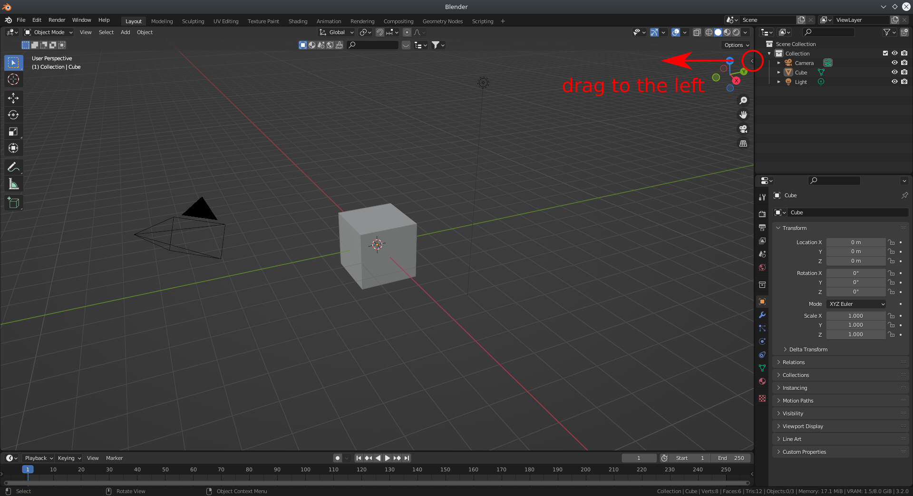
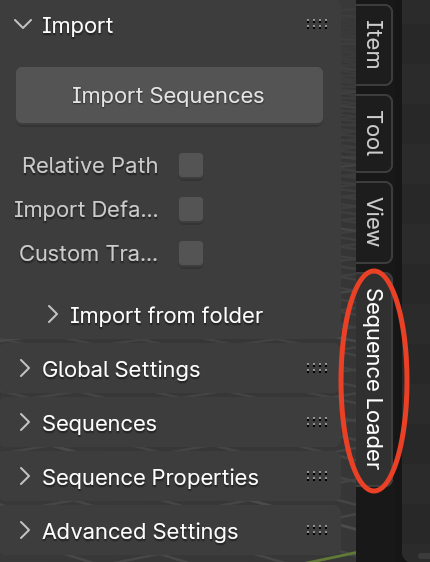
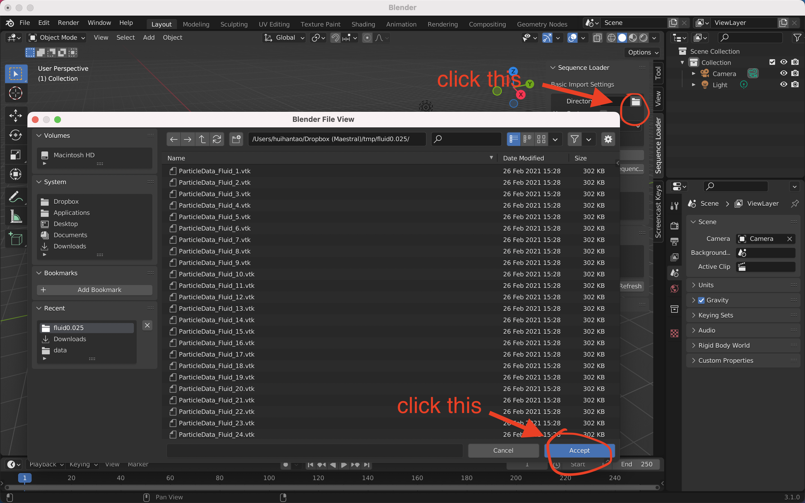
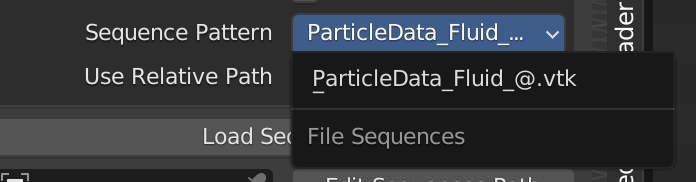
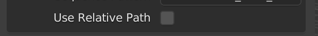
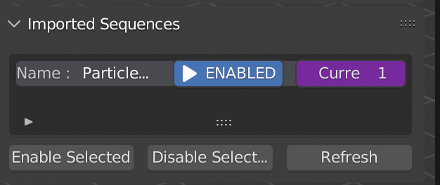
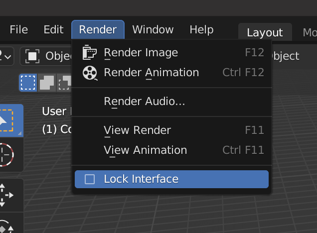
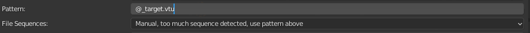

This is an addon for Blender 3.1+ (might work with 2.8+ but has not been tested) that enables loading of file sequences. The addon comes bundled together with [meshio](https://github.com/nschloe/meshio) which enables the loading of geometric data from a multitude of file formats. As stated there, the supported formats are listed in the following. Note that not all of the formats have been tested and some issues may still occur.

> [Abaqus](http://abaqus.software.polimi.it/v6.14/index.html) (`.inp`),
> ANSYS msh (`.msh`),
> [AVS-UCD](https://lanl.github.io/LaGriT/pages/docs/read_avs.html) (`.avs`),
> [CGNS](https://cgns.github.io/) (`.cgns`),
> [DOLFIN XML](https://manpages.ubuntu.com/manpages/jammy/en/man1/dolfin-convert.1.html) (`.xml`),
> [Exodus](https://nschloe.github.io/meshio/exodus.pdf) (`.e`, `.exo`),
> [FLAC3D](https://www.itascacg.com/software/flac3d) (`.f3grid`),
> [H5M](https://www.mcs.anl.gov/~fathom/moab-docs/h5mmain.html) (`.h5m`),
> [Kratos/MDPA](https://github.com/KratosMultiphysics/Kratos/wiki/Input-data) (`.mdpa`),
> [Medit](https://people.sc.fsu.edu/~jburkardt/data/medit/medit.html) (`.mesh`, `.meshb`),
> [MED/Salome](https://docs.salome-platform.org/latest/dev/MEDCoupling/developer/med-file.html) (`.med`),
> [Nastran](https://help.autodesk.com/view/NSTRN/2019/ENU/?guid=GUID-42B54ACB-FBE3-47CA-B8FE-475E7AD91A00) (bulk data, `.bdf`, `.fem`, `.nas`),
> [Netgen](https://github.com/ngsolve/netgen) (`.vol`, `.vol.gz`),
> [Neuroglancer precomputed format](https://github.com/google/neuroglancer/tree/master/src/neuroglancer/datasource/precomputed#mesh-representation-of-segmented-object-surfaces),
> [Gmsh](https://gmsh.info/doc/texinfo/gmsh.html#File-formats) (format versions 2.2, 4.0, and 4.1, `.msh`),
> [OBJ](https://en.wikipedia.org/wiki/Wavefront_.obj_file) (`.obj`),
> [OFF](https://segeval.cs.princeton.edu/public/off_format.html) (`.off`),
> [PERMAS](https://www.intes.de) (`.post`, `.post.gz`, `.dato`, `.dato.gz`),
> [PLY](<https://en.wikipedia.org/wiki/PLY_(file_format)>) (`.ply`),
> [STL](<https://en.wikipedia.org/wiki/STL_(file_format)>) (`.stl`),
> [Tecplot .dat](http://paulbourke.net/dataformats/tp/),
> [TetGen .node/.ele](https://wias-berlin.de/software/tetgen/fformats.html),
> [SVG](https://www.w3.org/TR/SVG/) (2D output only) (`.svg`),
> [SU2](https://su2code.github.io/docs_v7/Mesh-File/) (`.su2`),
> [UGRID](https://www.simcenter.msstate.edu/software/documentation/ug_io/3d_grid_file_type_ugrid.html) (`.ugrid`),
> [VTK](https://vtk.org/wp-content/uploads/2015/04/file-formats.pdf) (`.vtk`),
> [VTU](https://vtk.org/Wiki/VTK_XML_Formats) (`.vtu`),
> [WKT](https://en.wikipedia.org/wiki/Well-known_text_representation_of_geometry) ([TIN](https://en.wikipedia.org/wiki/Triangulated_irregular_network)) (`.wkt`),
> [XDMF](https://xdmf.org/index.php/XDMF_Model_and_Format) (`.xdmf`, `.xmf`).

[fileseq](https://github.com/justinfx/fileseq) is used to identify and load file sequences, while [rich](https://github.com/Textualize/rich) and [python-future](https://github.com/PythonCharmers/python-future) are included to satisfy unmet dependencies of the other packages.

All data is loaded *just-in-time* when the Blender frame changes, in order to avoid excessive memory consumption. By default, the addon is able to load vertices, lines, triangles and quads. It is also able to automatically extract triangle and quad surface meshes from tetrahedral and hexahedral volume meshes. Scalar and vector attributes on vertices are also imported for visualization purposes. See the following documentation for a brief introduction.

**DISCLAIMER: This project is still very much under development, so breaking changes may occur at any time!**

- [1. Installation](#1-installation)
  - [1.1 Build from source (optional)](#11-build-from-source-optional)
  - [1.2 Install Addon](#12-install-addon)
  - [1.3 FAQs](#13-faqs)
- [2. How to use](#2-how-to-use)
  - [2. Load the animation sequence you want](#2-load-the-animation-sequence-you-want)
    - [2.1 Absolute vs. Relative Paths](#21-absolute-vs-relative-paths)
    - [2.2 Sequence List View](#22-sequence-list-view)
      - [2.2.1 Enable/ Disable](#221-enable-disable)
      - [2.2.1 Refresh Sequence](#221-refresh-sequence)
    - [2.3 Settings](#23-settings)
    - [2.3.1 Geometry Nodes](#231-geometry-nodes)
    - [2.3.2 Path Information](#232-path-information)
    - [2.3.3 Attributes Settings](#233-attributes-settings)
    - [2.3.4 Split Norm per Vertex](#234-split-norm-per-vertex)
    - [2.3.5 Advanced Settings](#235-advanced-settings)

## 1. Installation

### 1.1 Build from source (optional)

1. Clone the project to download both project and dependencies

```shell
git clone https://github.com/InteractiveComputerGraphics/blender-sequence-loader.git  --recurse-submodules
```

2. Build the installable `.zip` file by simply running the following command.  This should produce a file called `blender_sequence_loader_{date}.zip`, where `{date}` is replaced with todays date. No other dependency other than standard python3 libraries are needed to build the addon.

```shell
python3 build_addon.py
```

### 1.2 Install Addon

After obtaining an installable `.zip` file either from the releases page or from manually building the addon, this should be installed into blender. For more information on how to install addons see [here](https://docs.blender.org/manual/en/latest/editors/preferences/addons.html#installing-add-ons) for more details.

### 1.3 FAQs

1. You may need to restart blender after enabling the addon for the first time, otherwise some functionality may not work. Technically this should not be **required**, but might be necessary in some untested versions of Blender.

2. You may have to manually remove old versions of this addon (if present), before installing a new version into Blender. This should rarely be the case but might be the cause of some confusing error messages and issues.

## 2. How to use

DISCLAIMER: Some of the screenshots may not be up to date with the most recent version of the addon, especially with respect to the text and ordering of UI elements.

After installing addon, you can find it in the toolbar, which is accessible here or toggled by pressing the `n` key.



Then you can find it here.



### 2. Load the animation sequence you want

You can select the directory in which your data is located through the GUI by clicking the rightmost icon. It will open the default blender file explorer. Then you can go to the directory you want, for example, like image showed below. **You only need navigate to the directory and click "Accept". Files are shown but not selectable in this dialogue.**



Then the addon will automatically try to detect the sequences in this directory, so that you simply select the sequence you want. If the desired sequence is not shown, you can switch to enter a manual pattern, where a single `@` character is used to denote a running frame index.



#### 2.1 Absolute vs. Relative Paths

There is a small checkbox about whether to use `relative paths` or not.

When toggled on, the blender file must be saved before loading the sequence. Then this sequence will be loaded using relative path from the location of the saved `.blend` file. As such, if you move the `.blend` file in conjunction with the data to another directory (keeping their relative locations the same) the sequence loader will still work. This is especially useful when working with cloud synchronized folders, whose absolute paths may be different on different computers.

If toggled off (default), it will use absolute path to load the sequence. For this, the `.blend` file does not have to be saved in advance.



#### 2.2 Sequence List View

After the sequence being imported, it will be available in the `Imported Sequences` panel, with more settings being available in `Sequence Settings` panel once a sequence has been selected.



By default, all supported file formats are simply imported as geometry (a collection of vertices, lines, triangles and quads). As such, you should be able to directly play/render the animation if it contains geometry.

Note: When rendering the animation, please turn on the `Lock Interface`. This will prevent artifacts from occurring, especially if the user continues to operate the Blender interface during the render process.



##### 2.2.1 Enable/ Disable

It is possible to individually enable and disable sequences from updating when the animation frame changes. This is very useful when working with very large files or many sequences as it reduces the computational overhead of loading these sequences.
`Enabled` means, that the sequence will be updated on frame change, and `Disabled` means that the sequence won't be updated on frame change.

##### 2.2.1 Refresh Sequence

`Refresh Sequence` can be useful when the sequence is imported while the data is still being generated and not yet complete. Refreshing the sequence can detect the frames added after being imported.

#### 2.3 Settings

#### 2.3.1 Geometry Nodes

While all files are imported as plain geometry, we provide some templates that we have found to be incredibly useful for visualizing particle data.

Applying the `Point Cloud` geometry node, the vertices of the mesh are converted to a point cloud, which can be rendered only by [cycles](https://docs.blender.org/manual/en/latest/render/cycles/introduction.html) and only as spheres. The exact geometry node setup can be seen in the geometry nodes tab and may be modified as desired, e.g. to set the particle radius.

Applying `Instances` geometry nodes, the vertices of the mesh are converted to cubes, which can be rendered by both [eevee](https://docs.blender.org/manual/en/latest/render/eevee/index.html) and [cycles](https://docs.blender.org/manual/en/latest/render/cycles/introduction.html). The exact geometry node setup can be seen in the geometry nodes tab and may be modified as desired, e.g. to set the particle radius and to change the instanced geometry. **CAUTION: Because this node setup relies on the `Realize Instances` node, the memory usage increases extremely rapidly. Make sure to save the `.blend` file before attempting this, as Blender may run out of memory!!!**

Applying the `Mesh` geometry node will restore the default geometry nodes, which simply display the imported geometry as it is.

Notes:

1. `Instances` is super memory hungry compared with `Point Cloud`.
2. After applying `Point Cloud` or `Instances` geometry nodes, you need to assign the material inside the geometry nodes. So to save your work, you can simply assign the material here, then apply the `Point Cloud` or `Instances` geometry nodes.
3. To access the attributes for shading, use the `Attribute` node in the Shader Editor and simply specify the attribute string. The imported attributes can be seen in the spreadsheet browser of the Geometry Nodes tab and are also listed in the addon UI.



#### 2.3.2 Path Information

This shows the path of the sequence for debugging purposes, however it's not editable.

#### 2.3.3 Attributes Settings

This panel shows the available **Vertex Attributes**, it's not editable.

Note: In order to avoid conflicts with Blenders built-in attributes, all the attributes names are renamed by prefixing `bseq_`. For example, `id` -> `bseq_id`. Keep this in mind when accessing attributes in the shader editor.

#### 2.3.4 Split Norm per Vertex

We also provide the ability to use a per-vertex vector attribute as custom normals for shading.
For more details check the official documentation [here](https://docs.blender.org/manual/en/latest/modeling/meshes/structure.html#modeling-meshes-normals-custom).

Note: the addon does not check if the selected attribute is suitable for normals or not. E.g. if the data type of the attribute is int instead of float, then Blender will simply give a runtime error.

#### 2.3.5 Advanced Settings

TODO
