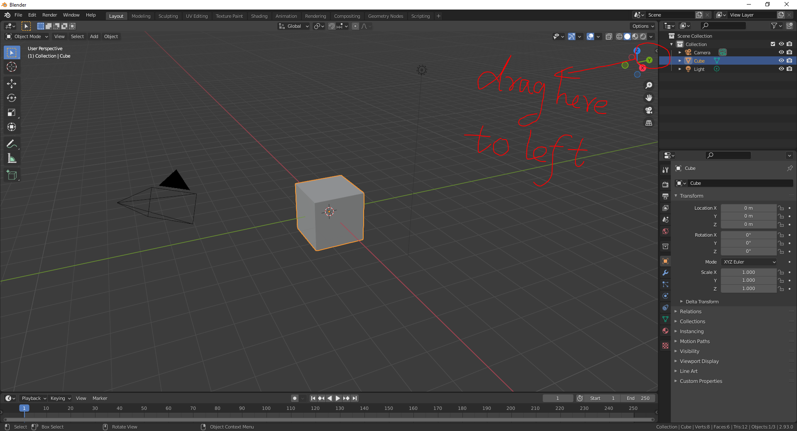
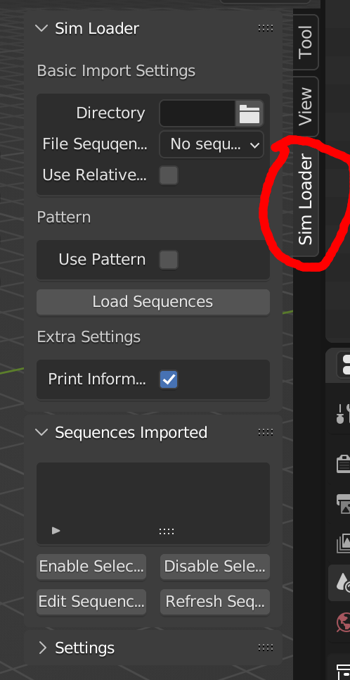
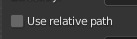

# Blender Tool
Loading animation sequences with meshio and fileseq

## 1. Clone the project
`git clone https://www.graphics.rwth-aachen.de:9000/hhui/blendertool  --recurse-submodules` to download both project and dependency

## 2. Build & Install

1. Build manually

    Clone the project as mentioned above, then run `python build_addon.py`, no additional dependency required, only python3 standard library.

2. Or download directly the addon from [release](https://graphics.rwth-aachen.de:9000/hhui/blendertool/-/releases) page. 

After have the .zip file, install it using blender addon system.

Note: don't forget to remove old addon, before add new version addon to blender. (Actually, I not very sure if it's necessary, but I think this would be better)

### 2.1 Complicated way

// TODO

If you want to keep developing on this addon, then you should look at this part, otherwise, you can simply ignore this part.

## 3. How to use

After installing addon, you can find it here.

Then you can find it here.

### 3. Load the animation sequence you want.

#### 3.1
You can either type the file directory you want manually in this box.

    
Or you can select the directory through GUI, by clicking the rightmost icon.

    
It will pop up the default blender file explorer, For example

    
Then you can go to the directory you want, for example, like image showed above. **You only need to go to the directory, then select nothing, just click "Accept"**.

Then you will see this in the addon panel.

    
Similarly, you can just type this directory in the input box. **Only to the directory, not the specific file(s)**

##### 3.1.1
There is a small checkbox about where using `relative path` or not.

when toggling on, then you must save the blender file first, before load the sequence. Then this sequence will be loaded using relative path, from the .blend file. Also if you move the .blend file and data altogether to another directory, it still works.

If not toggling on, it will use abosulte path to load the sequence. And you don't need to save the .blend file.

#### 3.2

After selecting the directory, it will automatically detect all the sequences in this directory.

##### 3.2.1
In the `File Sequences` box, you can either see `No sequence detected`, in most cases, it means the directory is empty.

##### 3.2.2
Or `Manual, too much sequence detected, use pattern above`, it either means, it does have too many sequences in this directory, or the sequence can't be deteced because the file name does not follow some pattern.

So you can type the sequence in the `Pattern` input box. For example, in this case, the files inside are `1_target.vtu`, `2_target.vtu`, and so on, it doesn't follow the desired pattern, so you have to type it manually.

For more details about the desired pattern, please check it [here](https://github.com/justinfx/fileseq). In gerneral, you only need to replace the numbers to `@`, e.g. `1_target.vtu` -> `@_target.vtu`.

##### 3.2.3

If the file name followes the desired pattern, and only a few (smaller than 20) sequences in this directory, it should detect them without any problems.

And you can just click the sequence you want. Also you can manually type the sequence, and click `Manual, use pattern above`.

Note: if you manually type the sequence, please click the `Manual` as file sequence after finish typing, so it will do some pre-check.

#### 3.3

You can play or render the animation as usually used in blender.

Here it showes all the sequences loaded. And you can click on each of them, it showes the relative information.

+ start: The frame this sequence will start to animate. (Default 0 )

+ end: The frame this sequence will stop to animate.(Default 500).

    For example, if start set to 50, and stop set to 100, then sequence will animate between frame 50 and 100. Before frame 50, it will always show the frame 50, and after frame 100, it will always show the frame 100. And if the sequence length is shorter than 50 frames, then the sequence will loop again and again between frame 50 and 100.

+ min value: value used when coloring the object, the object attribute value smaller than min value will be clamped as min value here. Editable, and has effect.

+ max value: Similiar to min value, but means the max value when clamping.

+ Color Field: attribute used to color the object. Default `None`

+ radius: **particles only**, set the radius of particles.

+ display method: **particles only**, how the particles are shown in viewport, either `Point`, which is a simple point, or `Rendered`, which is almost the same as rendered result. 

#### 3.4

You can also remove the sequence you want, by selecting the sequence, then click "Minus" button.

### 3.5  Rendering

Same as the way to render other objects, you can find it on the top right corner of blender.

.

When rendering animation, **please toggle on `Lock Interface`**

You can adjust the start frame and end frame at the bottom of blender. 

**Note: By default, blender set the start from frame 1, but this addon will start to render object from frame 0.**

**Important**

If rendering particles, **it only works with `Cycles` render engine**. For mesh sequences, it works with both `Cycles` and `Eevee`.

You can change to `Cycles` engine, at the `Render Properties` tab of blender.

After choosing `Cycles`, which usually renders much slower than `Eevee`, you can speed up by turn down the `Render` and `Viewport`, of course, it will sacrifice image quality.

## 5. Limitations
1. **Never** use undo, or blender default delete operation(you can use the minus button to delete a sequence), with sequence objects. It will change some blender object structure, and this addon can't function any more.

2. Sometimes, it could have very strange look in viewport, but it can be rendered correctly.
