# Blender Tool
Loading animation sequences with meshio and fileseq


## 1. Clone the project
`git clone https://www.graphics.rwth-aachen.de:9000/hhui/blendertool  --recurse-submodules` to download both project and dependency

### 1.1 Windows Users

Before go ahead, please delete the `meshio`, `future` and `fileseq` file, they should be a symlink to the extern folder, but it doesn't work on windows. 

Then you need to create the symlink again, by following command

```Batchfile
mklink /d meshio extern\meshio\src\meshio 
mklink /d fileseq extern\fileseq\src\fileseq 
mklink /d future extern\python-future\src\future
```
Note: You may need to run this with administrator, or using delevoper mode. For more details, please find [here](https://blogs.windows.com/windowsdeveloper/2016/12/02/symlinks-windows-10/).

> There is no change in how to call mklink.  For users who have Developer Mode enabled, the mklink command will now successfully create a symlink if the user is not running as an administrator.

Something else: I have tried the command `git clone -c core.symlinks=true` to clone the project directly with symlink, but it seems it will create a symlink to a **file**, but in this case, it is linked to a **folder**, so is not what I want. If you have find any better solution with this, please let me know.

### 1.2 Linux & Mac Users

It should work without any problems.


## 2. Build & Install

1. Build manually


    Clone the project as mentioned above, then create a zip file of this entire folder.

2. Download directly the addon from [release](https://graphics.rwth-aachen.de:9000/hhui/blendertool/-/releases) page. 

After have the .zip file, install it using blender addon system.


Note: don't forget to remove old addon, before add new version addon to blender. (Actually, I not very sure if it's necessary, but I think this would be better)

## 3. How to use

After installing addon, you can find it here.

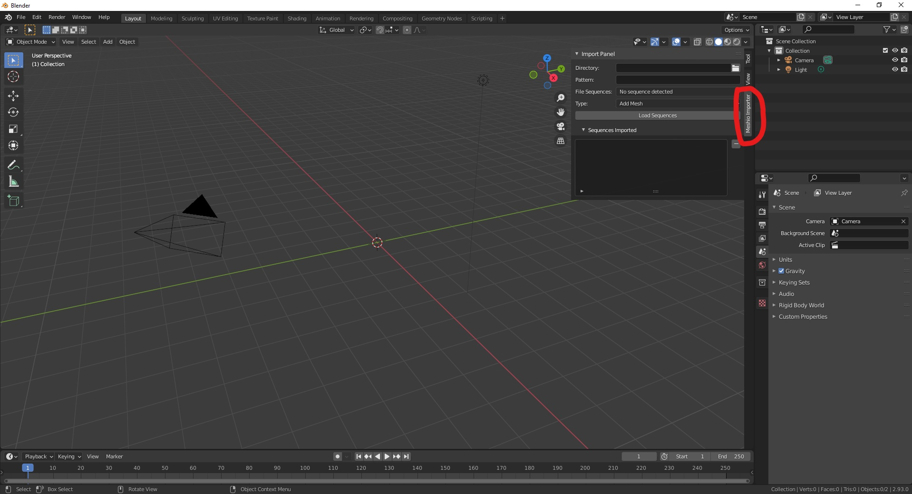

### 3. Load the animation sequence you want.

#### 3.1
You can either type the file directory you want manually in this box.

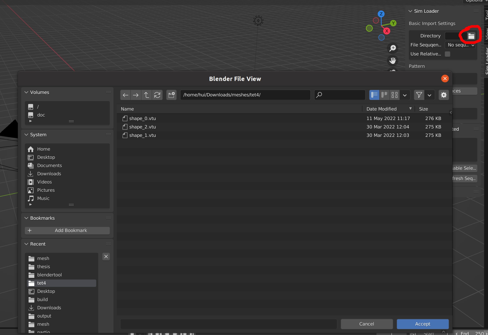
    
Or you can select the directory through GUI, by clicking the rightmost icon.

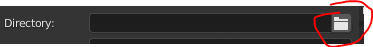
    
It will pop up the default blender file explorer, For example

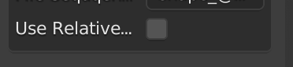
    
Then you can go to the directory you want, for example, like image showed above. **You only need to go to the directory, then select nothing, just click "Accept"**.

Then you will see this in the addon panel.

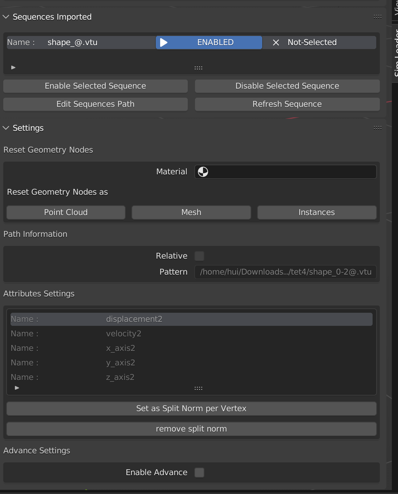
    
Similarly, you can just type this directory in the input box. **Only to the directory, not the specific file(s)**


#### 3.2

After selecting the directory, it will automatically detect all the sequences in this directory.

##### 3.2.1
In the `File Sequences` box, you can either see `No sequence detected`, in most cases, it means the directory is empty.

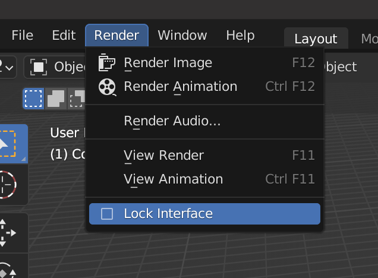

##### 3.2.2
Or `Manual, too much sequence detected, use pattern above`, it either means, it does have too many sequences in this directory, or the sequence can't be deteced because the file name does not follow some pattern.

So you can type the sequence in the `Pattern` input box. For example, in this case, the files inside are `1_target.vtu`, `2_target.vtu`, and so on, it doesn't follow the desired pattern, so you have to type it manually.


For more details about the desired pattern, please check it [here](https://github.com/justinfx/fileseq). In gerneral, you only need to replace the numbers to `@`, e.g. `1_target.vtu` -> `@_target.vtu`.

##### 3.2.3

If the file name followes the desired pattern, and only a few (smaller than 20) sequences in this directory, it should detect them without any problems.

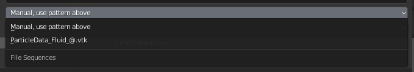

And you can just click the sequence you want. Also you can manually type the sequence, and click `Manual, use pattern above`.


Note: if you manually type the sequence, please click the `Manual` as file sequence after finish typing, so it will do some pre-check.


#### 3.3

Before you want to load the sequence, please save the blender project as a `.blender` file first. Then after selecting the animation sequence, you can simply click `Load Sequence`.

You can play or render the animation as usually used in blender.

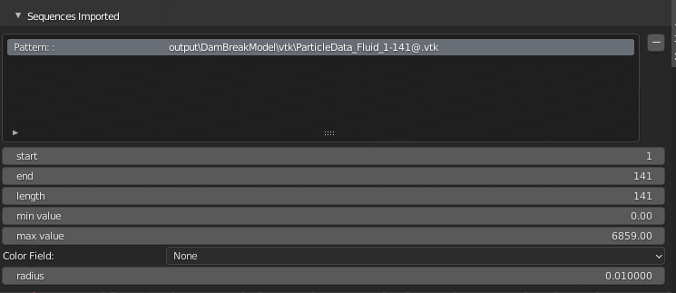

Here it showes all the sequences loaded. And you can click on each of them, it showes the relative information.

+ start: means the number of first frame file. e.g. here it means `ParticleData_Fluid_1.vtk`. Though it's editable, but nothing will happen if you edit it.

+ end: similiar to `start`, but the last frame file.

+ length: means how many files in this sequence.

+ min value: value used when coloring the object, the object attribute value smaller than min value will be clamped as min value here. Editable, and has effect.

+ max value: Similiar to min value, but means the max value when clamping.

+ Color Field: attribute used to color the object. Default `None`

+ radius: **particles only**, set the radius of particles.

+ display method: **particles only**, how the particles are shown in viewport, either `Point`, which is a simple point, or `Rendered`, which is almost the same as rendered result. 

#### 3.4

You can also remove the sequence you want, by selecting the sequence, then click "Minus" button.

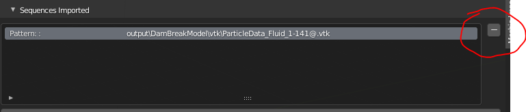

### 3.5  Rendering

Same as the way to render other objects, you can find it on the top right corner of blender.
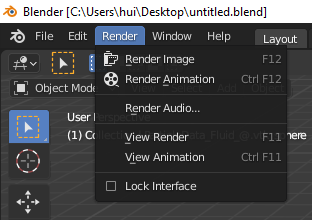.

When rendering animation, **please toggle on `Lock Interface`**

You can adjust the start frame and end frame at the bottom of blender.

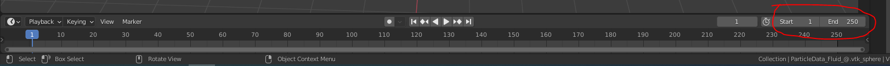

**Important**

If rendering particles, it only works with `Cycles` render engine. For mesh sequences, it works with both `Cycles` and `Eevee`.

You can change to `Cycles` engine, at the `Render Properties` tab of blender.

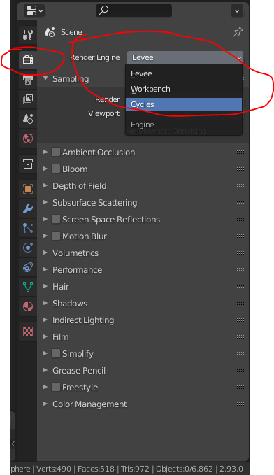

After choosing `Cycles`, which usually renders much slower than `Eevee`, you can speed up by turn down the `Render` and `Viewport`, of course, it will sacrifice image quality.

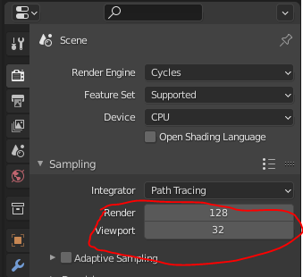


## 4. Some features

1. after saving `.blender` file, the sequences still work after restarting the `.blender` file.

2. Relative path (aniamtion data and `.blender` file ) are used inside, so it is safe to move the data and `.blender` file togethore to another location or machine.

## 5. Limitations
1. Sometimes, it could have very strange look in viewport, but it can be rendered correctly.