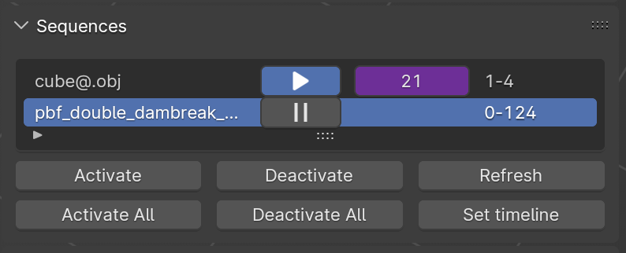

[](https://blender-sequence-loader.readthedocs.io/en/latest/?badge=latest)

## News

* Now available for installation as an extension from the [Blender Marketplace](https://extensions.blender.org/add-ons/sequence-loader/)!

***

This is an addon for Blender 4.2+ (might work with 2.8+ but is not extensively tested on less recent versions) that enables loading of file sequences. All data is loaded *just-in-time* when the Blender frame changes, in order to avoid excessive memory consumption. By default, the addon is able to load vertices, lines, triangles and quads. It is also able to automatically extract triangle and quad surface meshes from tetrahedral and hexahedral volume meshes. Scalar and vector attributes on vertices are also imported for visualization purposes. 

The addon comes bundled together with [meshio](https://github.com/nschloe/meshio) which enables the loading of geometric data from a multitude of file formats. As stated there, the supported formats are listed in the following. Note that not all of the formats have been tested and some issues may still occur.

Confirmed to support:

- `.obj`
- `.ply`
- `.vtk`
  - points
  - triangles
  - quads
  - tets (only surface, automatic extraction)
  - hex (only surface, automatic extraction)

It also loads any additional supported data as geometry node attributes that can be used for shading etc.[fileseq](https://github.com/justinfx/fileseq) is used to identify and load file sequences, while [rich](https://github.com/Textualize/rich) and [python-future](https://github.com/PythonCharmers/python-future) are included to satisfy unmet dependencies of the other packages.

**DISCLAIMER: This project is still very much under development, so breaking changes may occur at any time!**

- [News](#news)
- [1. Installation](#1-installation)
  - [1.1 Install within blender.](#11-install-within-blender)
  - [1.2 Build from source (optional)](#12-build-from-source-optional)
  - [1.3 Install Addon](#13-install-addon)
  - [1.3 FAQs](#13-faqs)
- [2. How to use](#2-how-to-use)
  - [1. Load the animation sequence you want](#1-load-the-animation-sequence-you-want)
    - [1.1 Relative Paths](#11-relative-paths)
    - [1.2 Import Default Normals](#12-import-default-normals)
    - [1.3 Custom Transformation Matrix](#13-custom-transformation-matrix)
    - [1.4 Load sequences from folder (Legacy importer)](#14-load-sequences-from-folder-legacy-importer)
  - [2. Global Settings](#2-global-settings)
    - [2.1 Root Directory](#21-root-directory)
    - [2.2 Print Sequence Information](#22-print-sequence-information)
    - [2.3 Auto Refresh Active Sequences](#23-auto-refresh-active-sequences)
    - [2.4 Auto Refresh All Sequences](#24-auto-refresh-all-sequences)
  - [3. Sequence List View](#3-sequence-list-view)
      - [3.1 Activate / Deactivate Sequences](#31-activate--deactivate-sequences)
      - [3.2 Refresh Sequence](#32-refresh-sequence)
    - [3.3 Activate / Deactivate All](#33-activate--deactivate-all)
    - [3.4 Set Timeline](#34-set-timeline)
  - [4. Sequence Properties](#4-sequence-properties)
    - [4.1 Match Blender Frame Numbers](#41-match-blender-frame-numbers)
    - [4.2 Path](#42-path)
    - [4.3 Pattern](#43-pattern)
    - [4.4 Current File](#44-current-file)
    - [4.5 Last Loading Time](#45-last-loading-time)
    - [4.6 Attributes Settings](#46-attributes-settings)
    - [4.6.1 Split Norm per Vertex](#461-split-norm-per-vertex)
  - [5. Advanced Settings](#5-advanced-settings)
    - [5.1 Script](#51-script)
    - [5.2 Geometry Nodes](#52-geometry-nodes)

## 1. Installation

### 1.1 Install within blender.

1. Go to `Preferences->Get Extensions` tab within Blender.
2. Search for `Sequence Loader`
3. Click install.


### 1.2 Build from source (optional)

1. Clone the project to download both project and dependencies

```shell
git clone https://github.com/InteractiveComputerGraphics/blender-sequence-loader.git  --recurse-submodules
```

2. Build the installable `.zip` file by simply running the following command.  This should produce a file called `blender_sequence_loader_{date}.zip`, where `{date}` is replaced with todays date. No other dependency other than standard python3 libraries are needed to build the addon.

```sh
./download_wheels.sh
blender --command extension build
```

### 1.3 Install Addon

After obtaining an installable `.zip` file either from the releases page or from manually building the addon, this should be installed into blender. For more information on how to install addons see [here](https://docs.blender.org/manual/en/latest/editors/preferences/addons.html#installing-add-ons) for more details.

### 1.3 FAQs

1. You may need to restart blender after enabling the addon for the first time, otherwise some functionality may not work. Technically this should not be **required**, but might be necessary in some untested versions of Blender.

2. You may have to manually remove old versions of this addon (if present), before installing a new version into Blender. This should rarely be the case but might be the cause of some confusing error messages and issues.

## 2. How to use

**Note**: When rendering the animation, please turn on the `Lock Interface`. This will prevent artifacts from occurring, especially if the user continues to operate the Blender interface during the render process.


After installing addon, you can find it in the toolbar, which is accessible here or toggled by pressing the `N` key.


Then you can find it here.


### 1. Load the animation sequence you want

The easiest way to import sequences is to use the large "Import Sequences" button. After pressing it, you can select as many sequences as you want which will be imported to the scene after pressing `Accept`.

#### 1.1 Relative Paths

The first option is the "Relative Path" option which is turned off by default, i.e. it uses absolute paths by default. 

To enable this option, the blender file has to be saved first. Then the sequences that are imported will be referenced using relative paths from the location of the saved `.blend` file. As such, if you move the `.blend` file in conjunction with the data to another directory (keeping their relative locations the same) the sequence loader will still work. This is especially useful when working with cloud synchronized folders, whose absolute paths may be different on different computers. 

To change the "Root Directory" to be somewhere else please have a look at the "Global Settings" section.

#### 1.2 Import Default Normals

The sequence loader tries to look for already stored normals that have to meet certain criteria depending on the file types. Currently supported are .obj and .vtk.

For .obj: 
- Normals have to be normalized to 1. Vertex normals as well as face vertex normals (each vertex can have a different normal for each face) are supported.
- Any normals are stored by using "vn". Vertex normals are simply referenced in the same order as the vertices and for face vertex normals, the respective index of the normal is stated in the third position where the vertex is referenced for face (e.g. 1/2/3 or 1//3 would reference the 3rd normal for the 1st vertex in some face).

For .vtk: 
- Only verex normals are supported. They have to be named "normals".

#### 1.3 Custom Transformation Matrix

When enabling this option, you can define a custom transformation matrix (using XYZ Euler Angles) that will be applied once when importing a sequence.

#### 1.4 Load sequences from folder (Legacy importer)

You can select the directory in which your data is located through the GUI by clicking the folder icon. It will open the default blender file explorer. Then, when you are in the desired folder, click `Accept`. You can't select any files in this GUI.

Then the addon will automatically try to detect the sequences in this directory, so that you simply select the sequence you want. If the desired sequence is not shown, you can enable the "Custom Pattern" option to enter a manual pattern, where a single `@` character is used to denote a running frame index.

The refresh button simply looks again for sequences in the selcted folder, in case there were any changes made.

Then click the `Load` Sequence" button to load the selected sequence or the `Load All` button to load all found sequences.


### 2. Global Settings

#### 2.1 Root Directory

This is where a new root directory can be set. All relative paths will be relative to this directory. If left empty, the file path of the Blender file will be used.

#### 2.2 Print Sequence Information

Print some useful information during rendering in a file located in the same folder as the render output and in the console. For the latter, Blender has to be started from the console. 

#### 2.3 Auto Refresh Active Sequences

Automatically refresh all active sequences whenever the frame changes. See "Refresh Sequence" for further explanations. This can be useful when generating a sequence and rendering is done simultaneously.

#### 2.4 Auto Refresh All Sequences

Like the above but with all sequences.

### 3. Sequence List View

After the sequence being imported, it will be available in the `Sequences` panel, with more settings being available in `Sequence Settings` panel once a sequence has been selected.



For each sequence we show the name, a button that shows whether a sequence is active or inactive (this button is clickable, see the next section for more details on the functionality), the current frame number which is also driver that can be edited as well as the smallest and largest number of the respective sequence.

##### 3.1 Activate / Deactivate Sequences

It is possible to individually activate or deactivate sequences from updating when the animation frame changes. This is very useful when working with very large files or many sequences as it reduces the computational overhead of loading these sequences.
`Activated` means, that the sequence will be updated on frame change, and `Deactivated` means that the sequence won't be updated on frame change.

##### 3.2 Refresh Sequence

`Refresh Sequence` can be useful when the sequence is imported while the data is still being generated and not yet complete. Refreshing the sequence can detect the frames added after being imported.

#### 3.3 Activate / Deactivate All

Activate or deactivate all sequences shown in the sequences view.

#### 3.4 Set Timeline

Sets the Blender timeline to range of the smallest to largest number of a file of the selected sequence.

### 4. Sequence Properties

#### 4.1 Match Blender Frame Numbers

This shows the file of a sequence at the frame number exactly matching the number in the file, otherwise it will not show anything. So if a file sequence goes from 2-10 and 15-30 only at these frames the respective files will be shown.

By default this option is turned off and the sequence starts in Blender from 0 and on each following frame the next available file is loaded. For frame number larger than the length of the file sequence, this procedure is looped.

#### 4.2 Path

The path of the file sequence is shown here and can also be edited. Relative paths start with // which basically is placeholder for the root directory.

#### 4.3 Pattern

Here you can see and edit the pattern of a file sequence that is used to detect the sequence as well as to determine how many frames the sequence has. A pattern consists of the name, then the frame range followed by an @ and at last, the file extension.

#### 4.4 Current File

This is read-only and shows the absolute path of the file that is currenlty loaded from the selected sequence.

#### 4.5 Last Loading Time

Read-only field, that shows how long it took to load the current file in milliseconds.

#### 4.6 Attributes Settings

This panel shows the available **Vertex Attributes**, it's not editable.

Note: In order to avoid conflicts with Blenders built-in attributes, all the attributes names are renamed by prefixing `bseq_`. For example, `id` -> `bseq_id`. Keep this in mind when accessing attributes in the shader editor.

#### 4.6.1 Split Norm per Vertex

We also provide the ability to use a per-vertex vector attribute as custom normals for shading.
For more details check the official documentation [here](https://docs.blender.org/manual/en/latest/modeling/meshes/structure.html#modeling-meshes-normals-custom).

Note: the addon does not check if the selected attribute is suitable for normals or not. E.g. if the data type of the attribute is int instead of float, then Blender will simply give a runtime error.

### 5. Advanced Settings

#### 5.1 Script

Here you can import your own script for loading and preprocessing your file sequences. For more information look at the teplate.py file under Scripting -> Templates -> Sequence Loader -> Template.

#### 5.2 Geometry Nodes

While all files are imported as plain geometry, we provide some templates that we have found to be incredibly useful for visualizing particle data.

Applying the `Point Cloud` geometry node, the vertices of the mesh are converted to a point cloud, which can be rendered only by [cycles](https://docs.blender.org/manual/en/latest/render/cycles/introduction.html) and only as spheres. The exact geometry node setup can be seen in the geometry nodes tab and may be modified as desired, e.g. to set the particle radius.

Applying `Instances` geometry nodes, the vertices of the mesh are converted to cubes, which can be rendered by both [eevee](https://docs.blender.org/manual/en/latest/render/eevee/index.html) and [cycles](https://docs.blender.org/manual/en/latest/render/cycles/introduction.html). The exact geometry node setup can be seen in the geometry nodes tab and may be modified as desired, e.g. to set the particle radius and to change the instanced geometry. **CAUTION: Because this node setup relies on the `Realize Instances` node, the memory usage increases extremely rapidly. Make sure to save the `.blend` file before attempting this, as Blender may run out of memory!!!**

Applying the `Mesh` geometry node will restore the default geometry nodes, which simply display the imported geometry as it is.

Notes:

1. `Instances` is super memory hungry compared with `Point Cloud`.
2. After applying `Point Cloud` or `Instances` geometry nodes, you need to assign the material inside the geometry nodes. So to save your work, you can simply assign the material here, then apply the `Point Cloud` or `Instances` geometry nodes.
3. To access the attributes for shading, use the `Attribute` node in the Shader Editor and simply specify the attribute string. The imported attributes can be seen in the spreadsheet browser of the Geometry Nodes tab and are also listed in the addon UI.


