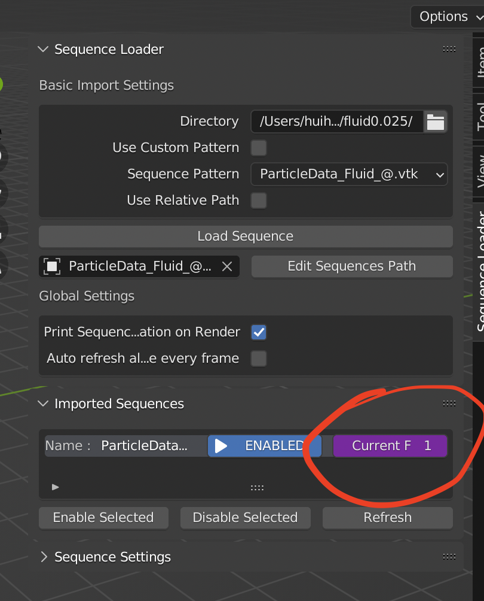
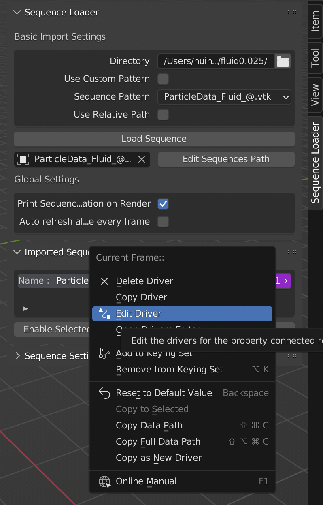

Frame control
=============

.. warning::
	The frame control system is currently under construction. It seems that blender has an internal issue when evaluating user specified Driver expressions when ``Lock Interface`` is enabled. However, this is required for our addon. We will enable this feature again once the issue has been resolved. You can track the progress `here <https://developer.blender.org/T102807>`_. Until then, you can make use of the **Custom Script** functionality to achieve the same goal.

You can use Blenders `driver system <https://docs.blender.org/manual/en/latest/animation/drivers/index.html>`_ to control the frame of the sequence.

Default settings
*****************

Each sequence has its own property ``Current Frame`` to control its frame. By default, the value equals to the `blender current frame <https://docs.blender.org/manual/en/latest/editors/timeline.html#frame-controls>`_.

Change the value
*****************

Right click on the ``Current Frame`` property, then click ``Edit Driver``. You can check  `here <https://docs.blender.org/manual/en/latest/animation/drivers/drivers_panel.html>`_ for more details about how to edit the driver.

