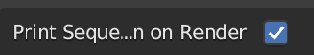
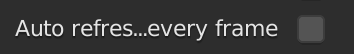

# Global Settings

There are two global settings
1. Print information: default on
1. Auto Refresh: default off

## Print information

When this button toggled, it will print information about the sequence imported by this addon, such as name of the object into a file.

The file has the name `bseq_{time}`, `{time}` is the time when rendering starts.

The file will be in the same direction as [blender render output directory](https://docs.blender.org/manual/en/latest/editors/preferences/file_paths.html#render). [^1]

[^1]: By default the value is `/tmp`, and this directory does not exit on windows system. So when the directory does not exist, it won't print information into file.

## Auto Refresh

When this button toggled, it will [refresh](./list.md#refresh) **all the sequence whenever frame changes**.

This option can be useful when some of the sequences are imported while the data is still being generated and not yet complete. Refreshing all the sequences can detect the frames added after being imported.

