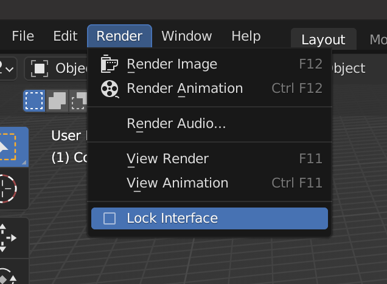
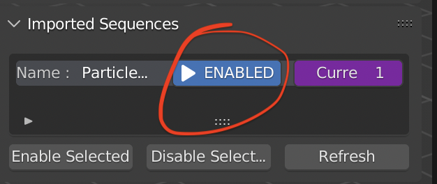

# List View

By default, all supported file formats are simply imported as geometry (a collection of vertices, lines, triangles and quads). As such, you should be able to directly play/render the animation if it contains geometry.

Note: When rendering the animation, please turn on the [Lock Interface](https://docs.blender.org/manual/en/latest/interface/window_system/topbar.html?#render-menu)[^1]. This will prevent artifacts from occurring, especially if the user continues to operate the Blender interface during the render process. This is doubly relevant when using custom normals on meshes, as this might cause Blender to crash instead of just failing to load the correct geometry.

[^1]: We have also had users stating that they are able to render perfectly well without enabling this setting, so you might be fine to disable this option if you need to.

## Imported Sequence

Here you can have an overview of all the sequences imported by this addon. When selecting a sequence, it will change the selected [active object](https://docs.blender.org/manual/en/latest/scene_layout/object/selecting.html#selections-and-the-active-object) as well. Vice versa, when the [active object](https://docs.blender.org/manual/en/latest/scene_layout/object/selecting.html#selections-and-the-active-object) changes, it will change the selection in this list view as well.

## Enable & Disable

It is possible to individually enable and disable sequences from updating when the animation frame changes. This is very useful when working with very large files or many sequences as it reduces the computational overhead of loading these sequences. Enabled means, that the sequence will be updated on frame change, and Disabled means that the sequence won't be updated on frame change.

To toggle an individual sequence, you can click on the `ENABLED` or `DISABLED` button in the list view.

### Enable Selected & Disable Selected

When you want to enable or disable multiple sequences, you can [select](https://docs.blender.org/manual/en/latest/scene_layout/object/selecting.html) multiple objects in the viewport, and then click `Enable Selected` or `Disable Selected` to enable/disable all selected objects.

## Current Frame

`Current Frame` shows the current frame of sequence being loaded. By default, the value is [blender current frame](https://docs.blender.org/manual/en/latest/editors/timeline.html#frame-controls). For advanced usage, you can refer [here](./frame.md).

## Refresh

`Refresh Sequence` can be useful when the sequence is imported while the data is still being generated and not yet complete. Refreshing the sequence can detect the frames added after being imported.
