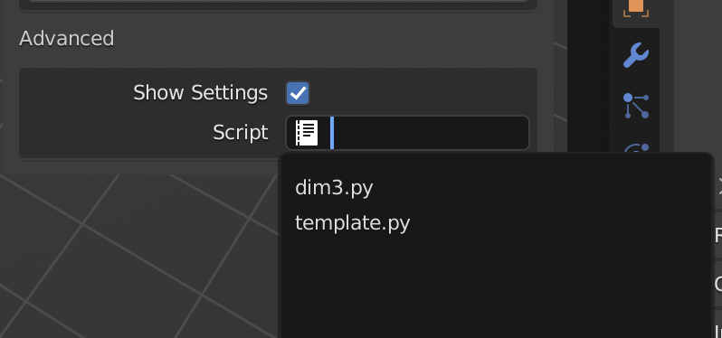
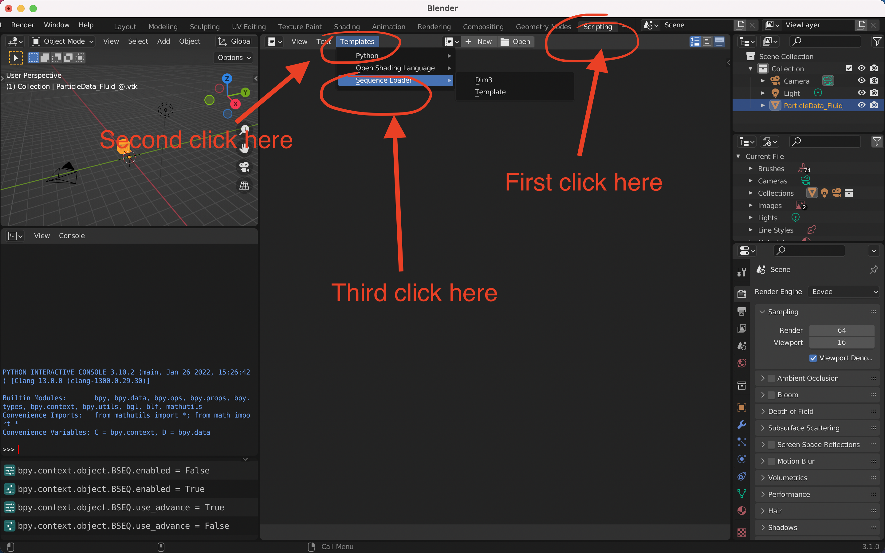

# Custom Script

If you want to have your own way to import the mesh object, then you can write your own python script to read and import the mesh object. **Technically, you can write any python code here, risks are on your own.**

The script is assigned to **each object**, you can have different script for each different object.

## How to Enable it

By default, this feature is turned off. You can enable it here by toggling the `Show Settings` in `Advanced` panel, then you can select the script you want to assign to this object.




## Template

We provide a simple template to show you how to do it. You can find the template as the image.



### template.py

This one is the same as default behavior of this addon.

### dim3.py

This template provides a way to import 3-d meshes, particularly tetrahedra and hexahedron. 

The default behavior of the addon is that faces inside 3-d meshes are discards, since we can't see that. But sometimes, these inner faces can be useful, and you can use this addon to import these inner faces.


## Write Your Own Script

If you want to write your own script, you only need to implement one of two methods. One is `preprocess`, another one is `process`.


### Notes:
There are many things to be careful here
1. `process` has higher priority than `preprocess`, when `process` exist, `preprocess` will be ignored.
2. When neither of these two functions exist, the addon will use the default behavior.
3. If you write any other things, it will be ignored, such as import modules, `import numpy`, or write a helper function.
4. If you need to import modules, write it inside the `preprocess` or `process` function. For example
```python
def preprocess(fileseq: fileseq.FileSequence, frame_number: int) -> meshio.Mesh:
    import math
    # math.sqrt(25)
```
5. There are some modules imported already, `numpy`, `meshio`, `fileseq`
6. There is some helper functions already, 
```python
def update_mesh(meshio_mesh: meshio.Mesh, mesh: bpy.types.Mesh):
    # this function reads `meshio_mesh`, then write it into `mesh`, and old information of `mesh` will be lost.
```


### preprocess

The function `preprocess` has the following signature
```python
def preprocess(fileseq: fileseq.FileSequence, frame_number: int) -> meshio.Mesh:
    pass
``` 
This function, takes 2 parameters
1. fileseq: the `filseq` object when imported
2. frame_number: blender current frame


This function expects a return value of `meshio.Mesh` object, and then the addon will write this `meshio.Mesh` into blender. For details about `meshio.Mesh` object, can be found [here](https://github.com/nschloe/meshio/wiki/meshio-Mesh()-data-structure).

### process

The function `preprocess` has the following signature
```python
def process(fileseq: fileseq.FileSequence, frame_number: int, mesh: bpy.types.Mesh):
    pass
``` 
This function, takes 2 parameters
1. fileseq: the `filseq` object when imported
2. frame_number: blender current frame
3. mesh: [bpy.types.Mesh](https://docs.blender.org/api/current/bpy.types.Mesh.html#bpy.types.Mesh) object

So, this function will directly read the file, then modify the `mesh` object, rather than constructing a `meshio.Mesh` object in the middle. It can be useful if `meshio.Mesh` is not powerful enough to hold the mesh information you want.

But in general, it's much more complicated to construct the `bpy.types.Mesh` object, so we will suggest to use `preprocess` for the most cases, unless you really need `process` function.