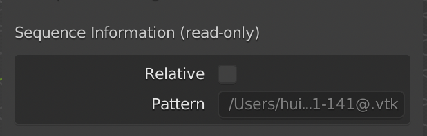
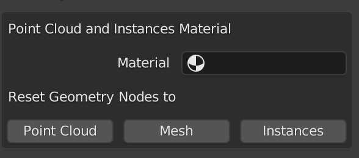
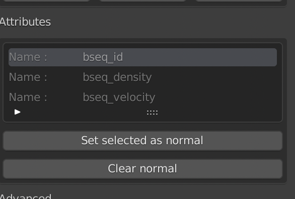

# Settings

Here you can find settings for each sequence.

## Sequence Information (read-only)

This is **read-only** information to show the pattern of this sequence, and if it's relative path or not.

## Geometry Nodes

While all files are imported as plain geometry, we provide some templates that we have found to be incredibly useful for visualizing particle data. The exact [geometry node](https://docs.blender.org/manual/en/latest/modeling/geometry_nodes/index.html) setup can be seen in the [geometry nodes tab](https://docs.blender.org/manual/en/latest/editors/geometry_node.html) and may be modified as desired, e.g. to set the particle radius.

Applying the `Point Cloud` geometry node, the vertices of the mesh are converted to a [point cloud](https://docs.blender.org/manual/en/latest/modeling/point_cloud.html), which can be rendered only by [cycles](https://docs.blender.org/manual/en/latest/render/cycles/introduction.html) and only as spheres. 

Applying `Instances` geometry nodes, the vertices of the mesh are converted to cubes, which can be rendered by both [eevee](https://docs.blender.org/manual/en/latest/render/eevee/index.html) and [cycles](https://docs.blender.org/manual/en/latest/render/cycles/introduction.html). You are free to change instanced object in [Geometry Node Editor](https://docs.blender.org/manual/en/latest/editors/geometry_node.html). 
 **CAUTION: Because this node setup relies on the [`Realize Instances`](https://docs.blender.org/manual/en/latest/modeling/geometry_nodes/instances/realize_instances.html) node, the memory usage increases extremely rapidly. Make sure to save the `.blend` file before attempting this, as Blender may run out of memory!!!**

Applying the `Mesh` geometry node will restore the default geometry nodes, which simply display the imported geometry as it is.

Notes:

1. `Instances` is super memory hungry compared with `Point Cloud`.
2. After applying `Point Cloud` or `Instances` geometry nodes, you need to assign the material inside the geometry nodes. So to save your work, you can simply assign the material here, then apply the `Point Cloud` or `Instances` geometry nodes.
3. To access the attributes for shading, use the [`Attribute`](https://docs.blender.org/manual/en/latest/render/shader_nodes/input/attribute.html) node in the [Shader Editor](https://docs.blender.org/manual/en/latest/editors/shader_editor.html) and simply specify the attribute string. The imported attributes can be seen in the [spreadsheet](https://docs.blender.org/manual/en/latest/editors/spreadsheet.html) browser of the Geometry Nodes tab and are also listed in the [addon UI](#attributes).

## Attributes

This addon can also import attributes[^1] of the mesh object into blender [attribute](https://docs.blender.org/manual/en/latest/modeling/geometry_nodes/attributes_reference.html) system.

Here it shows all the vertex attributes detected and imported. To avoid name collisions with [blender built-in attributes](https://docs.blender.org/manual/en/latest/modeling/geometry_nodes/attributes_reference.html#built-in-attributes), all names are renamed using `bseq_`  as prefix. Names are read-only. For example, `id` -> `bseq_id`. Keep this in mind when accessing attributes in the shader editor.

The value of the attributes can be viewed in blender [spreadsheet](https://docs.blender.org/manual/en/latest/editors/spreadsheet.html). There are many ways to use these attributes, such as [attribute node](https://docs.blender.org/manual/en/latest/render/shader_nodes/input/attribute.html) when shading,

[^1]: Vertex attributes only for now

### Split Norm per Vertex

We also provide the ability to use a per-vertex vector attribute as custom normals for shading. For more details check the official documentation [here](https://docs.blender.org/manual/en/latest/modeling/meshes/structure.html#modeling-meshes-normals-custom).

The button `Set selected as normal` will set current selected attribute as vertex normal[^2]. The button `Clear normal` will reset the vertex normal.

[^2]: The addon does not check if the selected attribute is suitable for normals or not. E.g. if the data type of the attribute is int instead of float, then Blender will simply give a runtime error.