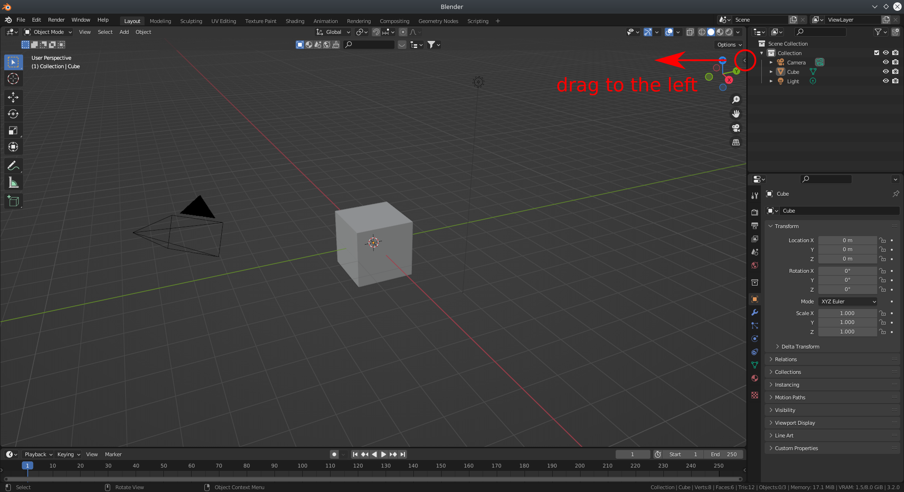
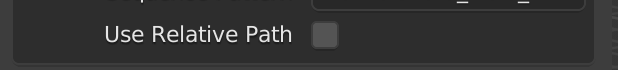

# Usage
 
**DISCLAIMER**: Some of the screenshots may not be up to date with the most recent version of the addon, especially with respect to the text and ordering of UI elements.

The following clip shows the basic usage of the addon. In particular, it shows how to load and render a sequence of particles data.

For the supported file formats refer to [here](./format.md).

## Access

After installing addon, you can find it in the toolbar, which is accessible by clicking on the small arrow at the top right of the viewport or by pressing the `n` key on the keyboard.

Then you can find it here.

## Basic Import Settings

### Directory

You can select the directory in which your data is located through the GUI by clicking the rightmost icon. It will open the default blender file explorer. Then you can go to the directory you want, for example, like image showed below. **You only need to navigate to the directory and click "Accept". Files are shown but not selectable in this dialogue.**

### Absolute vs. Relative Paths

There is a small checkbox asking whether you want to use relative paths or not.

When toggled **on**, the blender file **must be saved before loading the sequence**. Then this sequence will be loaded using the relative path from the location of the saved `.blend` file. As such, if you move the `.blend` file in conjunction with the data to another directory (keeping their relative locations the same) the sequence loader will still work. This is especially useful when working with cloud synchronized folders, whose absolute paths may be different on different computers.

If toggled **off (default)**, it will use the **absolute path to load the sequence**. For this, the `.blend` file does not have to be saved in advance.

### File Sequences

After selecting the directory, the addon will automatically detect all sequences in this directory, and automatically select the first one as the default value in `Sequence Pattern` box. If only one sequence exists, it will be used by default. When there are multiple patterns you can use the dropdown to select a different pattern.

The sequences that can be detected usually have the format `{name}{frame_number}.{extension}`. For example, two files with names `Example0.obj`, `Example1.obj` can be detected as a sequence. For more details, you can check it in [fileseq](https://github.com/justinfx/fileseq) project.

#### Custom Pattern

Sometimes, the addon can't detect the sequences correctly, or there are too many sequences in this directory. Then you can manually type the sequence.

First, enable the `Use Custom Pattern` button, then `Sequence Pattern` becomes to editable.

The grammar for this sequence is to use a `@` or `#` as an indicator for a frame index. An example could be `example@.vtk`. For more details, you can check the [fileseq](https://github.com/justinfx/fileseq#check-a-directory-for-one-existing-sequence) project.

## Edit Sequence

Sometimes, if you want to keep the setup of the current blender file, such as name and materials, but you want to change the loaded files. You can do this by using `Edit Sequence Path`.

First, you need to select the sequence you want to edit. You can select [**any of the objects imported by this addon**](./list.md). By default, the value is the [current active object](https://docs.blender.org/manual/en/latest/scene_layout/object/selecting.html#selections-and-the-active-object). If current object is not imported by this addon, such as a general cube, light, then it's the last active object imported by this addon.

After clicking the `Edit Sequence Path`, the sequence information will be updated to the sequence provided in [Basic Import Settings](#basic-import-settings).

