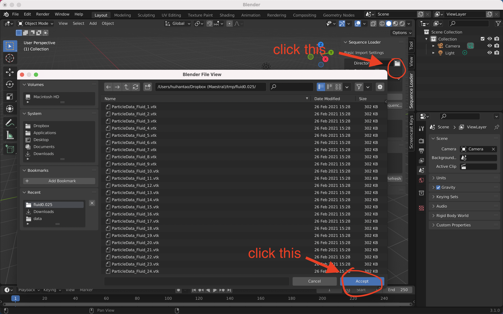
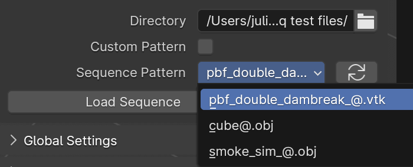

# Usage
 
**DISCLAIMER**: Some of the screenshots may not be up to date with the most recent version of the addon, especially with respect to the text and ordering of UI elements.

Here is a gif to show the basic usage of this addon. In this gif, it shows how to load and render a sequence of particles data. This is the same as [this one](./about.md#basic-usage).

For the format supported by this addon, you can find it [here](./format.md)

## Access

After installing addon, you can find it in the toolbar, which is accessible by here or toggled by pressing the `n` key.

Then you can find it here.

## Basic Import Settings

### Directory

You can select the directory in which your data is located through the GUI by clicking the rightmost icon. It will open the default blender file explorer. Then you can go to the directory you want, for example, like image showed below. **You only need to navigate to the directory and click "Accept". Files are shown but not selectable in this dialogue.**

### Absolute vs. Relative Paths

There is a small checkbox about whether to use relative paths or not.

When toggled **on**, the blender file **must be saved before loading the sequence**. Then this sequence will be loaded using relative path from the location of the saved `.blend` file. As such, if you move the `.blend` file in conjunction with the data to another directory (keeping their relative locations the same) the sequence loader will still work. This is especially useful when working with cloud synchronized folders, whose absolute paths may be different on different computers.

If toggled **off (default)**, it will use **absolute path to load the sequence**. For this, the `.blend` file does not have to be saved in advance.

### File Sequences

After selecting the directory, the addon will automatically detect all sequences in this directory, and use the first one as the default value in `Sequence Pattern` box. If only one sequence exist, it will be used by default. When multiple pattern exist, if you want to use a different sequence pattern, simply select it.

The sequences can be detected usually has the format that `{name}{frame_number}.{extension}`. For example, two files with names `Example0.obj`, `Example1.obj` can be detected as a sequence. For more details, you can check it in [fileseq](https://github.com/justinfx/fileseq) project.

#### Custom Pattern

Sometimes, the addon can't detect the sequences correctly, or there are too many sequences in this directory. Then you can manually type the sequence.

First, enable the `Use Custom Pattern` button, then `Sequence Pattern` becomes to editable. And type the sequence you want.

The grammar for this sequence is, that use a `@` or `#` where you might expect to use `*` for a wildcard character, e.g. numbers. An example could be `example@.vtk`. For more details, you can check it in [fileseq](https://github.com/justinfx/fileseq#check-a-directory-for-one-existing-sequence) project.

## Edit Sequence

Sometimes, if you want to keep the information of this blender object, such as name, materials, but you want to change the files loaded, you can do this by `Edit Sequence Path`

First, you need to select the sequence you want to edit. You can select [**all the objects imported by this addon**](./list.md). By default, the value is the [current active object](https://docs.blender.org/manual/en/latest/scene_layout/object/selecting.html#selections-and-the-active-object). If current object is not imported by this addon, such as a general cube, light, then it's the last active object imported by this addon.

Second, After clicking the `Edit Sequence Path`, the sequence information will be changed to the sequence provided in [Basic Import Settings](#basic-import-settings).

